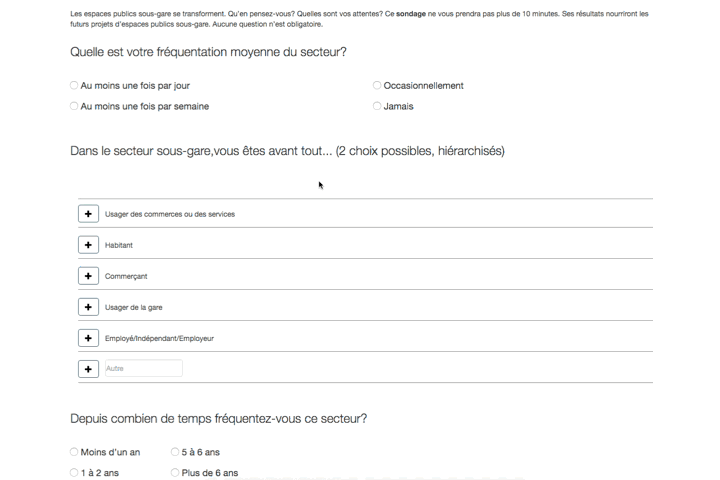
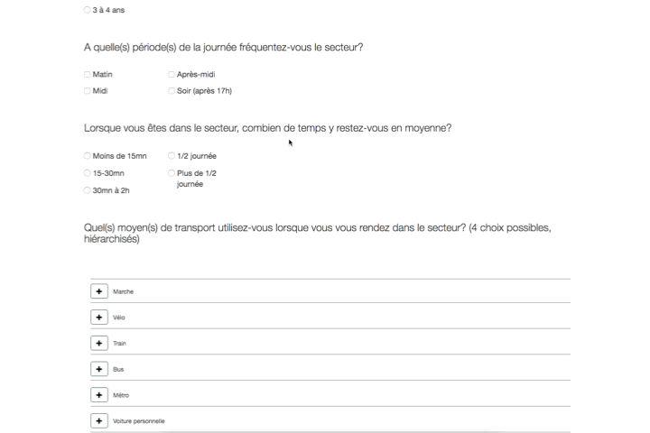
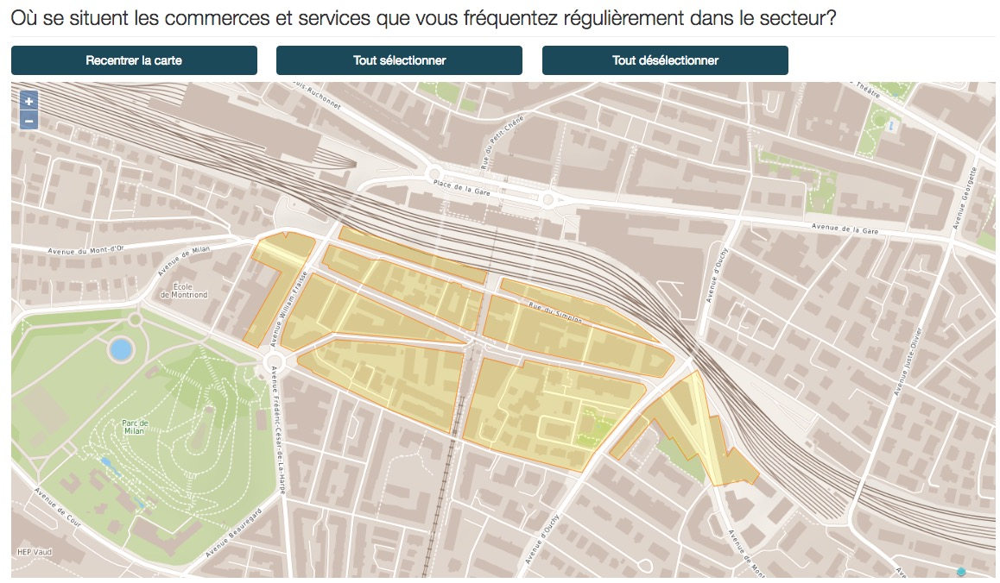
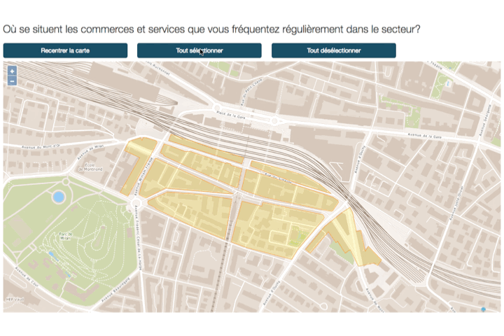
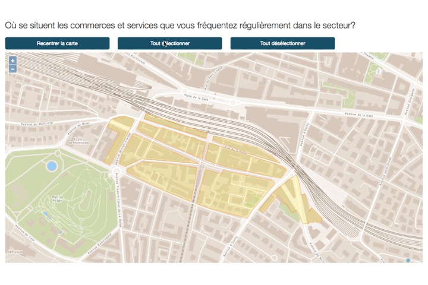

# README

Survey-Pole-Gare is the survey used by the municipality of Lausanne to get feedback on the [Pole gare](http://pole-gare.ch/) urbanistic project from interested citizens.

The project is a lengthy survey with cartographic questions. Users can **select features on maps** to respond to some questions. This is very useful for our use case. This also brings some challenges that we discuss in this document.

We used [OpenLayers 3](http://openlayers.org/) *v3.17.1* for the cartography part. It is free, open source and quite easy to use.

## Scroll page without blocking on maps
We have a very long page and people need to scroll to navigate through the questions or to have a look at the form. We have multiple page-wide maps. Maps have native user behaviors that alow the user to zoom with the mouse's scroll (on desktop) or drag it with your fingers (on mobile). But these interactions are also used to scroll on the page. So what happens when you are scrolling and your finger or your cursor hit the map? The map takes control of the scroll. Your smooth scroll is suddenly stopped and you are zooming on max level (desktop) or dragging the map to the top of its bbox (mobile).



We would like to avoid that. When users are scrolling they should not be stopped by maps. Our **workaround** is to detect window scroll events and disable the map’s default behavior.

```javascript
var scrollStarted = false;
var timer = null; 
window.onscroll = function (e) { // (1.)
  if(!scrollStarted){
    scrollStarted = true
    var map = mapManager.getMap();
    map.getInteractions().forEach(function(e){ // (2.) 
      if(e instanceof ol.interaction.MouseWheelZoom){
        e.setActive(false);
      }
      if(e instanceof ol.interaction.DragPan){
        e.setActive(false);
      }
      if(e instanceof ol.interaction.PinchZoom){
        e.setActive(false);
      }    
    }); 
  }
  if(timer !== null) { // (3.)
    clearTimeout(timer);     
  }
  timer = setTimeout(function() { // (4.)
    scrollStarted = false;
    var map = mapManager.getMap();
    map.getInteractions().forEach(function(e){
      if(e instanceof ol.interaction.MouseWheelZoom){
        e.setActive(true);
      }
      if(e instanceof ol.interaction.DragPan){
        e.setActive(true);
      }
      if(e instanceof ol.interaction.PinchZoom){
        e.setActive(true);
      }    
    }) 
  }, 200);
}
```

1. We detect when the screen starts scrolling
2. We disable the map's default interactions (`MouseWheelZoom`,`DragPan`,`PinchZoom`)
3. If a timer is set, we cancel it
4. We chose to set a timer every time a scroll event is triggered. We figured that when users are scrolling they might stop for a short time. The maps interactions should not be active during this time. 200 ms is an arbitrary time that we chose. More investigation could be done to find the perfect time :-). After this _200 ms_ timer expires, the map's default interactions are enabled.

Now we can scroll our page as smoothly as it should be.


## ol3 Select all features then deselect them individually

We have geographical questions where users can select area(s) they frequent. A map can have up to 20 areas to select from so we put a button to *select* or *deselect all* areas with one click.

Here an exemple of our map with the 20 areas (in yellow) that can be select. Buttons above the map help the user _re-center the map_, _select all areas_ and _deselect all areas_.



With openlayers this is pretty simple to do but pretty weird as well.

To begin we need to set our map with the features (features are type of `ol.Feature` which represent areas)

```javascript
var vectorSource = new ol.source.Vector();
var feats = [];
$.get( "/plein.geojson", function( data ) {
  vectorSource.addFeatures(new ol.format.GeoJSON().readFeatures(data));
  feats = new ol.format.GeoJSON().readFeatures(data);
});
var vectorLayer = new ol.layer.Vector({
  source: vectorSource,
  style: new ol.style.Style({
    fill: mapManager.defaultFill(),
    stroke: mapManager.defaultStroke()
  })
});
map.addLayer(vectorLayer);
```

Then we have to setup the `ol.interaction.Select`

```javascript
var selectSingleClick = new ol.interaction.Select({
  condition: ol.events.condition.click,
  toggleCondition: ol.events.condition.click,
  multi: true,
  style: new ol.style.Style({
    fill: mapManager.selectFill(),
    stroke: mapManager.selectStroke()
  })
});
map.addInteraction(selectSingleClick);
```
This will enable the map's _select_ and _deselect_ interactions. Whith these interactions we can select/deselect features individually. To select all features in the same time we need to setup a custom button (`#map-select-all`). On click, this button will trigger some code that will: 
1. Get all the features already selected
2. Clear them all
3. Put all features (`feats`) inside the selected features array

```javascript
$('#q8 #map-select-all').on('click',function(e) {
  e.preventDefault();
  var selectableFeatures = selectSingleClick.getFeatures(); //
  selectableFeatures.clear();
  for (i = 0; i < feats.length; i++) { 
    selectableFeatures.push(feats[i]);
  }
});
```

To deselect all you just have to do the same without adding the features.

Now the problem is how to individually deselect features when you add them manually as we did. By default _ol3_ will not care about the features you added previously and will add them again in `selectSingleClick` zones collection. Below you will see an example of this.



You can see that if you select all features, you cannot deselect them individually. It's like if you’re selecting a selected feature.

To avoid it we have to override what happens when a select event is triggered.

```javascript
selectSingleClick.on('select', function(e) {
  var featuresArray = e.target.getFeatures().getArray() // (1.)
  var featuresIdArray = featuresArray.map(function(item){ return item.get('id') }); //(2.)
  var duplicates = featuresIdArray.filter(function(item, idx){ 
    return featuresIdArray.indexOf(item) != idx //(3.)
  });
  tempFeaturesCollection = e.target.getFeatures()
  var indexsToRemove = [] // Used to store duplicates features indexs
  if(duplicates.length > 0){ //(4.)
    tempFeaturesCollection.forEach(function (el,index) {
      if(el.get('id') == duplicates[0]){
        indexsToRemove.push(index)
      }
    });
    for (var i = indexsToRemove.length - 1; i >= 0; i--) {
      tempFeaturesCollection.removeAt(indexsToRemove[i]) // (5.)
    }
  }
});
```

As we said before, _ol3_ add the zones you select in the `selectSingleClick` zones collection. No matter if the feature is already present in the collection. We need to "manually" check the existence of the selected feature in the collection . This is how we proceeded.

1. Get the selected features collection as an `Array`
2. Map the array to get the feature’s ids
3. Check if the array contains duplicates
4. If it contains duplicates, parse the collection to know where the duplicate features are
5. We know the duplicates feature’s index so we can remove them from the feature collection.

Now it works




## Backup heroku database and import it to local database

First backup your database

`$ heroku pg:backups capture`

Then import it to your machine

`$ curl -o latest.dump 'heroku pg:backups public-url'`

Finally copy your data to your local database

`pg_restore --verbose --clean --no-acl --no-owner -d database_name latest.dump`

## Ruby on rails: How to divide array in columns for twitter bootstrap

This could be useful if you need to divide array into multiple columns to fit twitter bootstrap columns template.

```
.row
  .col-sm-3.col-md-2.col-xs-12
    - Survey.q3_answers.in_groups(2)[0].each do |item|
      .radio
        label
          = f.radio_button(:q3,"#{item}")
          = item
  .col-sm-3.col-md-2.col-xs-12
    - Survey.q3_answers.in_groups(2,false)[1].each do |item|
      .radio
        label
          = f.radio_button(:q3,"#{item}")
          = item
```

Use `in_groups(2)` to divide your arry in two parts. Then use `false` when you get the last part for padding any remaining slots.

## .env
The `config/database.yml` `config/secrets.yml` files use environment variables for some config values. Each contributor must have a `.env` file in the app root with values for the following environment variables:

* `DB_USER`
* `DB_NAME_DEV`
* `DB_NAME_TEST`
* `ADMIN_LOGIN`
* `ADMIN_PWD`

Example
    
`.env` content
  `DB_USER=[your_db_username]`
  
## Resources

[Scroll page without blocking on maps](#scroll-page-without-blocking-on-maps)

[ol3 Select all features then deselect them individually](#ol3-Select-all-features-then-deselect-them-individually)

[Backup heroku database and import it to local database](#backup-heroku-database-and-import-it-to-local–database)

[Ruby on rails: How to divide array in columns for twitter bootstrap](#ruby-on-rails-how-to-divide-array-in-columns-for-twitter-bootstrap)
